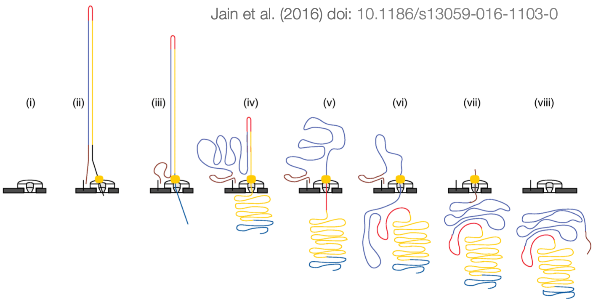
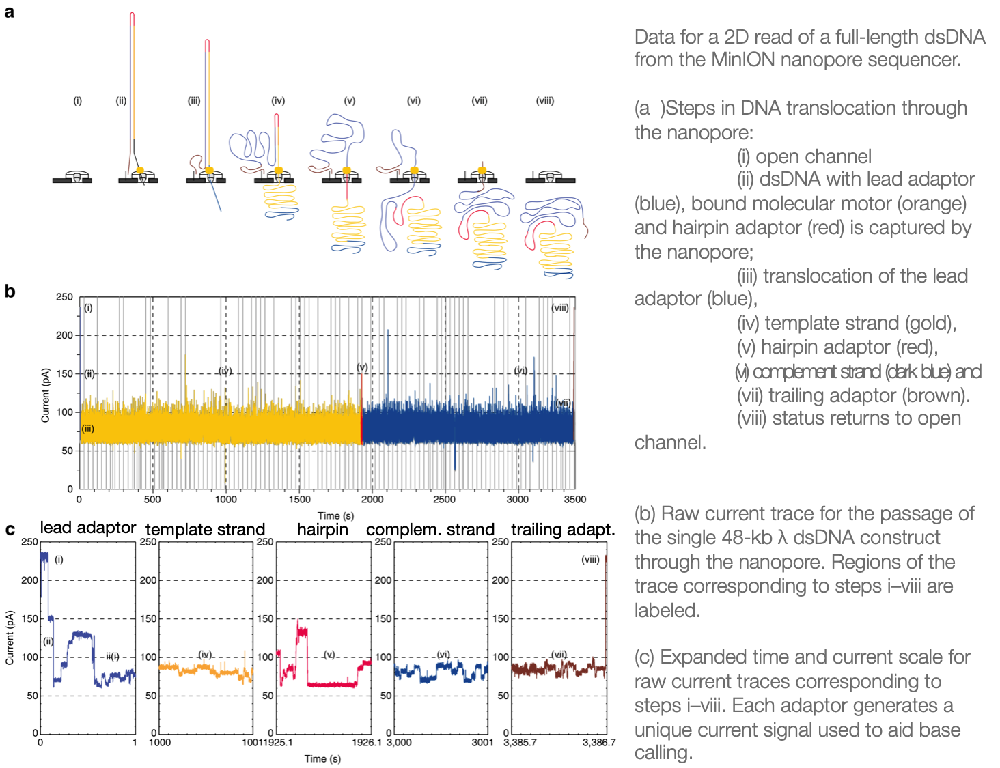

## Nanopore sequencing

Details of the methods were taken from [Deamer et al., 2016](https://www.nature.com/articles/nbt.3423#f3) and [Jain et al., 2016](https://genomebiology.biomedcentral.com/articles/10.1186/s13059-016-1103-0).

>BASIC PRINCIPLE: intact DNA is ratcheted through a nanopore base-by-base and the identity of the bases are determined by distinct changes in current.

* setup: 
    - membrane
    - salt solution
    - proteins that form pores just big enough to let single strands of DNA pass through
* the **nanopore** = biosensor _and_ only passageway for exchange between the ionic solution on two sides of a membrane
  - ionic conductivity through the narrowest region of the nanopore is particularly sensitive to the presence of a nucleobase's mass and its associated electrical field
  - different bases will invoke different changes in the ionic current levels that pass through the pore
* there's usuallly **5 bases** present within the narrowest spot of the nanopore!
* the DNA molecule is prepared for sequencing
    - fragmentation (mostly to achieve uniformity in the fragment size distributions)
    - **adapters** at both ends
        - *lead adapter* allows loading of a enzyme at the 5' end (the "motor protein")
        - *trailing adapter*: facilitates strand capture by concentrating DNA substrates at the membrane surface proximal to the nanopore
	- *hairpin adapter* permits contiguous sequencing of both strands: covalently connects both strands so that the second strand is not lost while the first is being passed through the pore

* the ratchet **enzyme**
    - ensures:
      - unidirectional and *single*-nucleotide displacement
      - at a *slow* pace so that the signal can actually be registered
      - is typically an enzyme that processes single-nucleotides in real life, e.g. polymerases, exonucleases etc. -- the trick, of course, is to inhibit the catalysis of the actual processing and to just make use of the protein's capability to access one nucleotide at a time
      

### Base calling

* Nanopore raw data: "squiggles"
    - i.e. electrical current over time
* Base calling = translate the raw electrical signal to the nucleotide sequence
* quite noisy because it's **single molecule data**
* base calleres mostly based on neuronal networks (originally: HMM)

ONT has developed four base callers to date (March 2019): ALbacore, Guppy, Scrappie, Flappie

## IT infrastructure

### MinKNOW

MinKNOW carries out several core tasks:

- Data acquisition
- Real-time analysis and feedback
- Data streaming
- Device control, including run parameter selection - Sample identification and tracking
- Ensuring chemistry is performing correctly

MinKNOW utilizes an intuitive graphical user interface (GUI) and receives updates on a regular basis. This is the core software provided by Oxford Nanopore, without which the sequencing devices cannot be run. Data from MinKNOW is packaged into individual read .fast5 files (over 1 million of which can be generated by a single flow cell), which are a customised file format based upon the .hdf5 file type. These .fast5 files are then used by other downstream software.

[source](https://community.nanoporetech.com/requirements_documents/minion-it-reqs.pdf)

### Guppy

Guppy is a production basecaller provided by Oxford Nanopore, and uses a command-line interface. It utilizes the latest in Recurrent Neural Network algorithms in order to interpret the signal data from the nanopore, and basecall the DNA or RNA passing through the pore. It is optimiszed for running with basecall accelerators e.g. GPUs. Guppy implements stable features into Oxford Nanopore Technologies’ software products, and is fully supported. It receives .fast5 files as an input, and is capable of producing: - .fast5 files appended with basecalled information
- .fast5 files that have been processed, but basecall information present in a separate FASTQ file

[source](https://community.nanoporetech.com/requirements_documents/minion-it-reqs.pdf)

It was preceded by `Albacore`.

>Albacore is a general-purpose basecaller that runs on CPUs. Guppy is similar to Albacore but can use GPUs for improved base-
calling speed. While the two basecallers have coexisted for about a year, ONT has discontinued
development on Albacore in favour of the more performant Guppy. [ref](https://www.biorxiv.org/content/early/2019/02/07/543439.full.pdf)

## Tutorials & software resources

* [ONT Tutorial Basic QC](https://github.com/nanoporetech/ont_tutorial_basicqc)
* [MinIONQC](https://github.com/roblanf/minion_qc): diagnostic plots and data for quality control of sequencing data from Oxford Nanopore's MinION and PromethION sequencer
* [pycoQC-2](https://github.com/a-slide/pycoQC): computes metrics and generates interactive QC plots for Oxford Nanopore technologies sequencing data
* [poretools Jupyter Notebook](https://nbviewer.jupyter.org/github/arq5x/poretools/blob/master/poretools/ipynb/test_run_report.ipynb), [poretools docs](https://poretools.readthedocs.io/en/latest/)
* [minimap2](https://github.com/lh3/minimap2#install)
* [de.NBI Nanopore Training Course](https://denbi-nanopore-training-course.readthedocs.io/en/latest/index.html)
